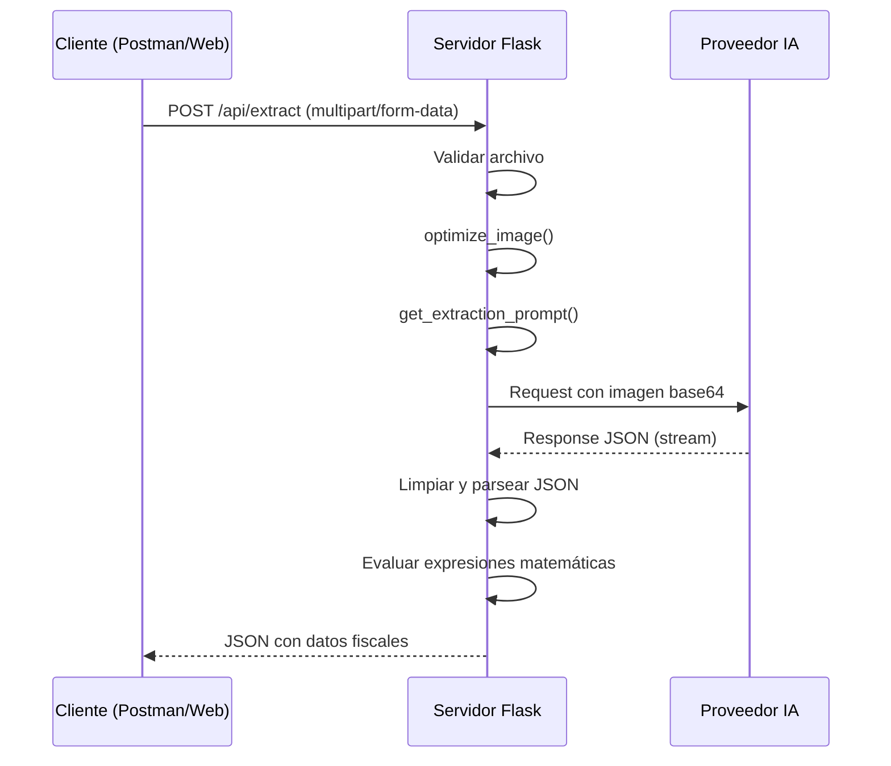

# API Reference - Invoice OCR Pro

Esta documentación técnica detalla todos los endpoints disponibles en la API REST del sistema.

---

## Diagrama de Secuencia



---

## Endpoints

### `GET /`

Retorna la interfaz web principal (SPA).

**Respuesta**: HTML

---

### `GET /api/models`

Retorna la lista de modelos de OpenRouter disponibles para selección en la UI.

**Respuesta**: 
```json
[
  {"id": "qwen/qwen-2.5-vl-7b-instruct:free", "name": "Qwen 2.5 VL 7B (Free)"},
  {"id": "google/gemini-2.0-flash-001", "name": "Gemini 2.0 Flash"},
  ...
]
```

---

### `GET /api/config`

Retorna la configuración actual del servidor desde `config.json`.

**Respuesta**:
```json
{
  "provider": "openrouter",
  "api_key": "sk-or-v1-...",
  "model_openrouter": "qwen/qwen-2.5-vl-7b-instruct:free",
  "model_ollama": "ministral-facturador-full"
}
```

---

### `POST /api/config`

Guarda la configuración en el servidor.

**Request Body (JSON)**:
```json
{
  "provider": "openrouter",
  "api_key": "sk-or-v1-nueva-clave",
  "model_openrouter": "google/gemini-2.0-flash-001"
}
```

**Respuesta**:
```json
{"status": "success", "message": "Configuración guardada en el servidor"}
```

---

### `POST /api/extract`

**Endpoint principal de extracción sincrónica.**

Recibe una imagen de factura y devuelve el JSON con los datos fiscales extraídos inmediatamente (sin streaming).

#### Request

| Header | Valor |
|--------|-------|
| `Content-Type` | `multipart/form-data` |

| Campo | Tipo | Requerido | Default | Descripción |
|-------|------|-----------|---------|-------------|
| `file` | File | ✅ | - | Imagen de la factura |
| `provider` | Text | ❌ | `config.json` | `ollama` o `openrouter` |
| `model` | Text | ❌ | `config.json` | ID del modelo |
| `api_key` | Text | ⚠️ | `config.json` | API Key de OpenRouter |

#### Response (200 OK)

```json
{
  "comprobante": {
    "tipo": "Factura",
    "letra": "A",
    "punto_venta": "00002",
    "numero": "00002428",
    "fecha_emision": "08/04/2025",
    "cae": "75148783087194",
    "vto_cae": "18/04/2025",
    "condicion_venta": "Contado"
  },
  "emisor": {
    "razon_social": "EMPRESA S.R.L.",
    "cuit": "30-71679447-0",
    "condicion_iva": "Responsable Inscripto",
    "domicilio": "San Martin 861"
  },
  "receptor": {
    "razon_social": "CLIENTE",
    "cuit": "20-12520574-8",
    "condicion_iva": "Responsable Monotributo"
  },
  "items": [
    {
      "cantidad": 1,
      "descripcion": "Producto ejemplo",
      "precio_unitario": 11500.00,
      "alicuota_iva": 21.0,
      "subtotal": 11500.00
    }
  ],
  "impuestos": {
    "neto_gravado_21": 218915.00,
    "iva_21": 45971.15,
    "percepcion_iva": 0.0,
    "percepcion_iibb": 0.0
  },
  "totales": {
    "subtotal_neto": 218915.00,
    "total_iva": 45971.15,
    "total_tributos": 0.0,
    "total": 264886.15
  }
}
```

#### Response (400 Bad Request)

```json
{"error": "No hay archivo en la petición"}
```

```json
{"error": "Se requiere api_key para OpenRouter (configúrala en la web o envíala en el form)"}
```

#### Response (401 Unauthorized)

```json
{"error": "OpenRouter Error (401): User not found."}
```

#### Response (422 Unprocessable Entity)

```json
{
  "error": "Respuesta malformada: Expecting property name enclosed in double quotes",
  "raw": "... respuesta cruda del modelo ..."
}
```

---

### `POST /process`

**Endpoint de extracción con streaming (SSE).**

Usado internamente por la interfaz web para mostrar progreso en tiempo real.

#### Request

Mismo formato que `/api/extract`.

#### Response (SSE Stream)

```
data: {"phase": "optimizing", "message": "Optimizando imagen...", "elapsed": 0}

data: {"phase": "optimized", "message": "Imagen optimizada (45.2 KB)", "elapsed": 0.3}

data: {"phase": "sending", "message": "Enviando a OpenRouter...", "elapsed": 0.5}

data: {"phase": "generating", "message": "Generando...", "tokens": 150, "tokens_per_sec": 25.5, "elapsed": 6.2}

data: {"phase": "complete", "message": "Completado en 8.5s", "tokens": 350, "elapsed": 8.5, "result": {...}, "processed_image": "base64..."}
```

---

## Códigos de Error

| Código | Nombre | Descripción |
|--------|--------|-------------|
| 200 | OK | Extracción exitosa |
| 400 | Bad Request | Falta archivo o API key |
| 401 | Unauthorized | API key inválida/expirada |
| 422 | Unprocessable Entity | JSON malformado del modelo |
| 500 | Internal Server Error | Error inesperado del servidor |
| 502 | Bad Gateway | Fallo de conexión con Ollama/OpenRouter |

---

## Ejemplos de Uso

### cURL

```bash
# Extracción básica (usa config del servidor)
curl -X POST http://localhost:5000/api/extract \
  -F "file=@factura.jpg"

# Extracción con parámetros explícitos
curl -X POST http://localhost:5000/api/extract \
  -F "file=@factura.jpg" \
  -F "provider=openrouter" \
  -F "model=google/gemini-2.0-flash-001" \
  -F "api_key=sk-or-v1-..."
```

### Python

```python
import requests

with open("factura.jpg", "rb") as f:
    response = requests.post(
        "http://localhost:5000/api/extract",
        files={"file": f}
    )

data = response.json()
print(f"Total: {data['totales']['total']}")
```

### JavaScript (Fetch)

```javascript
const formData = new FormData();
formData.append('file', fileInput.files[0]);

const response = await fetch('/api/extract', {
    method: 'POST',
    body: formData
});

const data = await response.json();
console.log('CAE:', data.comprobante.cae);
```

---

## Notas de Seguridad

> ⚠️ **Importante**: Nunca compartas tu API Key de OpenRouter en chats o foros públicos. El sistema de OpenRouter revoca automáticamente las claves detectadas en texto plano en internet.

La configuración se guarda localmente en `config.json`. Este archivo **no** debe ser commiteado a repositorios públicos. Asegurate de incluirlo en `.gitignore`.

