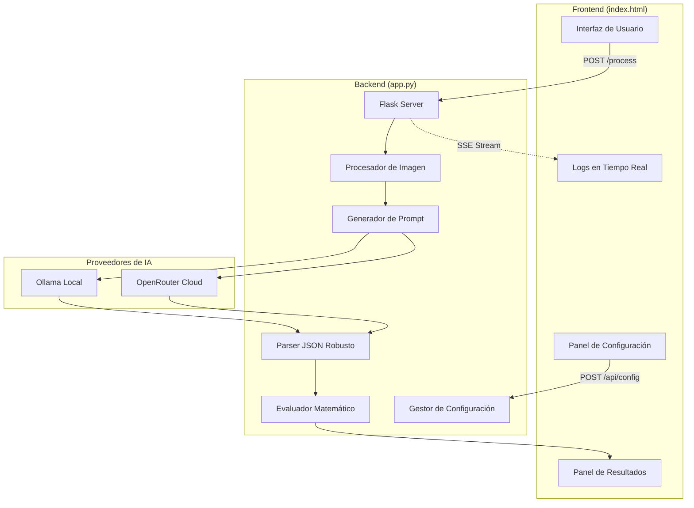

# Guía de Desarrollo - Invoice OCR Pro

Este documento explica la arquitectura interna, las decisiones de diseño y cómo extender el sistema.

---

## Diagrama de Componentes



---

## Decisiones de Diseño

### 1. ¿Por qué Vanilla JS en lugar de React/Vue?

- **Simplicidad**: El proyecto es una SPA de una sola página.
- **Sin Build Step**: Cualquiera puede modificarlo sin configurar Webpack/Vite.
- **Portabilidad**: Un solo archivo HTML que funciona en cualquier servidor.

### 2. ¿Por qué SSE en lugar de WebSockets?

- **Unidireccional**: El flujo de datos va del servidor al cliente sin respuesta.
- **Simplicidad**: No requiere librerías adicionales.
- **Compatibilidad**: Funciona sobre HTTP/1.1 estándar.

### 3. ¿Por qué config.json en lugar de base de datos?

- **Zero Dependencies**: No necesita Redis, SQLite ni PostgreSQL.
- **Transparencia**: El usuario puede editar el archivo manualmente.
- **Portabilidad**: Se puede versionar junto al código (excepto secrets).

### 4. ¿Por qué el Evaluador Matemático?

Algunos modelos de IA (especialmente los gratuitos como Qwen) devuelven expresiones como:

```json
"neto": 100 + 200 + 300
```

En lugar de:

```json
"neto": 600
```

El evaluador detecta estos patrones con regex y los resuelve antes del `json.loads()`:

```python
# Regex para detectar expresiones
r':\s*([\d\.\s\+\-\*\/\(\)]+(?:\s*[\+\-\*\/]\s*[\d\.\s\+\-\*\/\(\)]+)+)'

# Evaluación segura (sin builtins)
eval(expr, {"__builtins__": {}}, {})
```

---

## Pipeline de Imagen

```python
def optimize_image(image_bytes):
    # 1. Cargar y convertir a RGB
    img = Image.open(io.BytesIO(image_bytes))
    img = img.convert('RGB')
    
    # 2. Redimensionar a 1024px máximo
    if img.width > 1024:
        ratio = 1024 / img.width
        img = img.resize((1024, int(img.height * ratio)))
    
    # 3. Convertir a escala de grises
    img = img.convert('L')
    
    # 4. Autocontraste agresivo (elimina sombras)
    img = ImageOps.autocontrast(img, cutoff=0.5)
    
    # 5. Aumentar contraste
    img = ImageEnhance.Contrast(img).enhance(1.40)
    
    # 6. Nitidez extrema (UnsharpMask)
    img = img.filter(ImageFilter.UnsharpMask(
        radius=1.0, 
        percent=200, 
        threshold=1
    ))
    
    # 7. Borde blanco (mejora detección de bordes)
    img = ImageOps.expand(img, border=15, fill='white')
    
    return img
```

---

## Estructura del Prompt AFIP

El prompt está diseñado para maximizar la extracción de datos fiscales argentinos:

```
REGLAS DE ORO (CRÍTICAS):
1. VALORES NUMÉRICOS PUROS: No incluir cálculos.
2. JSON ESTRICTO: Solo el objeto JSON.
3. NO NOMBRES DE VARIABLES: Solo números finales.

INSTRUCCIONES FISCALES (ARGENTINA):
1. COMPROBANTE: Letra (A/B/C/M/E), PV, Número, CAE.
2. EMISOR/RECEPTOR: CUIT, Razón Social, Condición IVA.
3. ÍTEMS: Cantidad, Descripción, Precio, Alícuota, Subtotal.
4. IMPUESTOS: Neto por alícuota, IVA, Percepciones.
5. TOTALES: Subtotal, IVA, Tributos, Total final.
```

---

## Cómo Agregar un Nuevo Proveedor de IA

1. **Backend**: Agregar lógica en `app.py`:

```python
elif provider == "nuevo_proveedor":
    headers = {...}
    payload = {...}
    response = requests.post(NUEVO_API_URL, ...)
```

2. **Frontend**: Agregar opción en el toggle de proveedores en `index.html`.

3. **Config**: Actualizar `load_config()` y `save_config()` si necesita campos específicos.

---

## Testing

### Test Manual con cURL

```bash
# Test básico
curl -X POST http://localhost:5000/api/extract \
  -F "file=@test_factura.jpg" | jq .

# Test con provider específico
curl -X POST http://localhost:5000/api/extract \
  -F "file=@test_factura.jpg" \
  -F "provider=ollama" \
  -F "model=llama3.2-vision" | jq .
```

### Test de Configuración

```bash
# Guardar config
curl -X POST http://localhost:5000/api/config \
  -H "Content-Type: application/json" \
  -d '{"provider":"openrouter","api_key":"sk-or-v1-test"}'

# Leer config
curl http://localhost:5000/api/config | jq .
```

---

## Contribuir

1. Fork el repositorio.
2. Creá una rama: `git checkout -b feature/mi-mejora`.
3. Hacé tus cambios y commiteá.
4. Abrí un Pull Request.

### Áreas de Mejora Sugeridas

- [ ] Soporte para PDFs multipágina.
- [ ] Cache de respuestas para facturas idénticas.
- [ ] Validación de CUIT con algoritmo de Luhn.
- [ ] Export a Excel (XLSX) además de CSV.
- [ ] Integración con APIs de facturación (Facturante, Afip WS).

